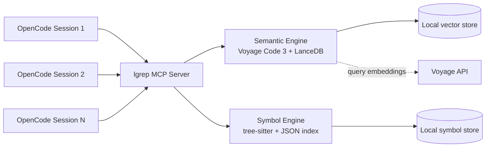

<h1 align="center">lgrep</h1>

<p align="center">
  <strong>Dual-engine code intelligence for <a href="https://github.com/opencode-ai/opencode">OpenCode</a></strong>
</p>

<p align="center">
  <a href="https://sharperflow.com/projects/lgrep">
    
  </a>
</p>

<p align="center">
  <a href="https://www.python.org"></a>
  <a href="LICENSE"></a>
  <a href="https://github.com/Sharper-Flow/lgrep"></a>
</p>

<p align="center">
  <a href="https://sharperflow.com/projects/lgrep">Project Page</a>
  &middot;
  <a href="https://github.com/Sharper-Flow/lgrep">GitHub</a>
  &middot;
  <a href="CHANGELOG.md">Changelog</a>
</p>

---

`lgrep` gives AI agents a better first move.

Instead of starting with `glob`, `grep`, and random file reads, agents can:

- search by meaning when they do not know the symbol yet
- search by symbol when they know the name
- inspect file and repo structure before opening code
- reuse one warm local server across multiple sessions and agents

That is the whole pitch: fewer bad searches, less wasted context, faster understanding for both humans and agents.

## What lgrep is

`lgrep` combines two complementary engines in one MCP server:

- **Semantic engine** - natural-language code search using Voyage Code 3 embeddings with local LanceDB storage
- **Symbol engine** - exact symbol, outline, and text tools using tree-sitter parsing with a local JSON index

Use the semantic engine to answer questions like:

- "where is auth enforced between route and service?"
- "how does retry logic work for failed requests?"
- "where are permissions checked?"

Use the symbol engine to answer questions like:

- "find the `authenticate` function"
- "show me the outline for `src/auth.py`"
- "get the symbol source for `UserService.login`"

Your code stays local. Only short semantic queries and indexing payloads go to Voyage. Symbol lookup stays fully local and works without an API key.

## Why it exists

AI coding agents usually fail early, not late.

They miss because they start with the wrong retrieval primitive:

- `grep` cannot answer concept questions
- full-file reads waste tokens on irrelevant code
- repeated local exploration across parallel agents duplicates work

`lgrep` fixes that by giving agents a search stack that matches how they actually reason:

1. find the implementation by intent
2. narrow to the right file or symbol
3. retrieve only the code that matters

For heavy OpenCode users, this is not a convenience plugin. It is search infrastructure.

## Why lgrep feels different

- **Intent-first search** - agents can ask by meaning before they know names
- **Exact structure tools** - file outlines, repo outlines, symbol lookup, and text search are in the same server
- **Local-first storage** - vectors and indexes live on disk, not in someone else's SaaS
- **Shared warm process** - one HTTP MCP server can serve multiple concurrent OpenCode sessions
- **Commercially usable** - `lgrep` is MIT licensed, so commercial use is allowed

## Comparisons

### lgrep vs grep and ripgrep

`grep` and `rg` are still the right tool for exact text and regex lookups. They are not good at intent discovery.

If the code says `jwt.verify()` and your agent asks "where is authentication enforced?", text search often misses the right entry point. Semantic search closes that gap.

### lgrep vs mgrep

[`mgrep`](https://github.com/mixedbread-ai/mgrep) is the closest semantic-search comparison point.

- `mgrep` is semantic-only
- `lgrep` combines semantic search with symbol and structure tools
- `mgrep` is cloud-oriented
- `lgrep` keeps vectors local and shares one warm server across agents

### lgrep vs jCodeMunch MCP

[`jcodemunch-mcp`](https://github.com/jgravelle/jcodemunch-mcp) is a strong symbol-first MCP server. It is built around tree-sitter indexing and precise byte-offset retrieval, which makes it good when an agent already knows roughly what symbol it wants and wants to minimize context spend.

`lgrep` is optimized for a different problem: the agent does not know the symbol yet and needs to find the right implementation by intent first, then drill into structure.

| | grep / rg | mgrep | jCodeMunch MCP | **lgrep** |
|---|---|---|---|---|
| **Primary strength** | Exact text / regex | Semantic search | Symbol retrieval | **Semantic discovery + symbol retrieval** |
| **Semantic search** | No | Yes | No | **Yes** |
| **Symbol tools** | No | No | Yes | **Yes** |
| **File / repo outline** | No | No | Yes | **Yes** |
| **Local vector storage** | N/A | No | N/A | **Yes** |
| **No API key mode** | Yes | No | Yes | **Yes (symbol engine)** |
| **Commercial usage** | Yes | Subscription service | Paid commercial license required per its README | **Yes (MIT)** |
| **Best first question** | "find this exact string" | "find code matching this concept" | "find this exact symbol" | **"find the code that implements this idea"** |

If you want the most precise symbol retrieval with no semantic layer, `jcodemunch-mcp` is a credible option.

If you want OpenCode agents to start with intent-level discovery and still have symbol tooling in the same server, `lgrep` is the better fit.

## How it works

### Architecture



```text
Agent -> lgrep MCP server -> semantic engine + symbol engine
```

### Semantic engine

1. Discover files while respecting `.gitignore`
2. Chunk code with AST-aware boundaries
3. Embed chunks with Voyage Code 3
4. Store vectors locally in LanceDB
5. Search with hybrid retrieval and reranking

### Symbol engine

1. Parse source with tree-sitter
2. Extract functions, classes, methods, and related structure
3. Store a local symbol index
4. Serve symbol search, outlines, and source retrieval without an API call

## Installation

### Requirements

- Python 3.11+
- a Voyage API key if you want semantic search

### Install from GitHub

```bash
pip install git+https://github.com/Sharper-Flow/lgrep.git
```

### Install from source

```bash
git clone https://github.com/Sharper-Flow/lgrep.git
cd lgrep
pip install .
```

## Fast setup for OpenCode

**stdio is the local default** for single-session / single-user setups — no server process needed. For shared or multi-session deployments, see [Scale-up: shared HTTP server](#3-scale-up-shared-http-server) below.

### 1. Get a Voyage API key

Create a key at [dash.voyageai.com](https://dash.voyageai.com/).

You only need this for the semantic engine. The symbol engine works without it.

### 2. Wire it into OpenCode

For single-user, single-session setups, stdio is the local default. Add this to `~/.config/opencode/opencode.json`:

```json
{
  "instructions": [
    "~/.config/opencode/instructions/lgrep-tools.md"
  ],
  "mcp": {
    "lgrep": { "type": "local" }
  }
}
```

If you prefer to run a shared HTTP server (see [section 3](#3-scale-up-shared-http-server)), swap the `mcp.lgrep` block for:

```json
{
  "mcp": {
    "lgrep": {
      "type": "remote",
      "url": "http://localhost:6285/mcp",
      "enabled": true
    }
  }
}
```

Or let the installer wire the shared-HTTP path automatically:

```bash
lgrep install-opencode
```

That installer will:

- create `~/.cache/lgrep/` for indexes and logs
- add a `type: "remote"` MCP entry pointing at `http://localhost:6285/mcp`
- copy the packaged `lgrep-tools.md` instruction and `skills/lgrep/SKILL.md` into your OpenCode config
- append the instruction file to the `instructions` array so agents prefer `lgrep` first

To use stdio with `lgrep install-opencode`, run the installer first and then change `mcp.lgrep` in `opencode.json` to `{ "type": "local" }`.

Important: the active agent must also expose `lgrep_*` tool definitions in its
tool manifest. If an agent profile only allows `read`/`glob`/`grep`, the model
cannot choose lgrep even when the MCP server is configured and the instruction
policy is present.

The installed files land at:

- `~/.config/opencode/instructions/lgrep-tools.md`
- `~/.config/opencode/skills/lgrep/SKILL.md`

### 3. Scale-up: shared HTTP server

For shared or multi-session deployments, run lgrep as a persistent HTTP server instead of stdio:

```bash
VOYAGE_API_KEY=your-key \
LGREP_WARM_PATHS=/path/to/project-a:/path/to/project-b \
lgrep --transport streamable-http --host 127.0.0.1 --port 6285
```

Why HTTP instead of stdio?

With stdio, each OpenCode session spawns its own server process. With `streamable-http`, one warm server handles all sessions. After starting the HTTP server, use the `type: "remote"` MCP config from section 2 above.

### 4. Optional: generate a `.lgrepignore`

```bash
lgrep init-ignore /path/to/project
```

### 5. Optional: inspect or prune orphan semantic caches

```bash
lgrep prune-orphans --dry-run
lgrep prune-orphans --execute --cache-dir /path/to/cache
```

`prune-orphans` is dry-run by default. Use `--execute` to actually delete orphaned semantic cache directories. `--cache-dir` overrides `LGREP_CACHE_DIR` for a single run. `--execute` and `--dry-run` are mutually exclusive; passing both exits with an error. Agents can call the same workflow via the `lgrep_prune_orphans` MCP tool listed in [Symbol tools](#symbol-tools); that path also skips projects currently loaded in the running server.

**Grace window.** Recently modified cache dirs are preserved for 1 hour by default so the pruner cannot race a live indexer. Override with `LGREP_PRUNE_MIN_AGE_S=<seconds>` (`0` disables grace entirely). The `missing_meta` and `project_path_enoent` reasons bypass the grace check because they are unambiguous.

**Transport-aware MCP safety.** When lgrep is reached over a shared transport (for example `streamable-http`), the MCP tool coerces `dry_run=True` regardless of the caller's request. Destructive prunes on shared deployments must go through the CLI (`lgrep prune-orphans --execute`) so the operator is explicit.

### Troubleshooting `prune-orphans --execute`

Each orphan is deleted independently. If `shutil.rmtree` fails for one entry (for example a lingering file lock or permission issue), the batch continues and the failure is recorded in the response under `failures[]` as `{path, error}`; the rest of the reclaim still lands. Re-run `lgrep prune-orphans --execute` after addressing the error, or inspect with `--dry-run` first to confirm the orphan is still present.

Deletion is refused for any path outside the resolved cache directory (path-confinement guard) and for any symlinked cache entry (TOCTOU guard) — both show up in `failures[]` rather than as successful deletes.

## First-use workflow

Typical OpenCode flow:

1. Ask an intent question with `lgrep_search_semantic`
2. Inspect structure with `lgrep_get_file_outline` or `lgrep_get_repo_outline`
3. Retrieve exact symbols with `lgrep_search_symbols` and `lgrep_get_symbol`

Examples:

```text
lgrep_search_semantic(query="authentication flow", path="/path/to/project")
lgrep_get_file_outline(path="/path/to/project/src/auth.py")
lgrep_index_symbols_folder(path="/path/to/project")
lgrep_search_symbols(query="authenticate", path="/path/to/project")
lgrep_get_symbol(symbol_id="src/auth.py:function:authenticate", path="/path/to/project")
```

High-value prompts:

- "Where do we enforce auth between route and service?"
- "Find the `authenticate` function"
- "What are the main symbols in `src/auth.py`?"
- "Show me the repo structure around billing"
- "Find references to `verifyToken`"

## Tool selection guide

| Task | Best tool | Why |
|---|---|---|
| Intent or concept discovery | `lgrep_search_semantic` | Search by meaning |
| Find a function or class by name | `lgrep_search_symbols` | Exact symbol lookup |
| Inspect a single file's structure | `lgrep_get_file_outline` | Fast AST outline |
| Inspect repo structure | `lgrep_get_repo_outline` | Symbol-level overview |
| Find exact text or identifiers | `lgrep_search_text` or `grep` | Literal match |
| Retrieve exact source for a symbol | `lgrep_get_symbol` | Targeted code retrieval |
| Read a known file directly | `Read` | No search needed |

## MCP response format

As of `3.0.0`, every lgrep MCP tool returns a structured dict matching a declared TypedDict in [`src/lgrep/server/responses.py`](src/lgrep/server/responses.py). Clients should consume responses as native dicts — no `json.loads` is needed.

Example — `lgrep_search_semantic`:

```python
{
    "query": "authentication flow",
    "path": "/path/to/project",
    "engine": "hybrid",
    "total": 3,
    "results": [
        {"file_path": "src/auth.py", "line_number": 42,
         "content": "...", "score": 0.91,
         "start_line": 42, "end_line": 87, "match_type": "hybrid"},
        # ...
    ],
}
```

`engine` is `"hybrid"` when `hybrid=true` (the default) or `"vector"` when `hybrid=false`.

Error responses use the shared `ToolError` shape:

```python
{"error": "VOYAGE_API_KEY not set. Cannot perform semantic search."}
```

Before `3.0.0`, tools returned these objects as `json.dumps(...)` strings. If you upgrade from `2.x`, remove any `json.loads(response)` wrappers on tool output. See the [Upgrade from 2.x](CHANGELOG.md#upgrade-from-2x) notes in the changelog for the full migration path.

## MCP tools

### Semantic tools

| Tool | Purpose |
|---|---|
| `lgrep_search_semantic(query, path, limit=10, hybrid=true)` | Search code by meaning |
| `lgrep_index_semantic(path)` | Build or refresh a semantic index |
| `lgrep_status_semantic(path?)` | Show semantic index and watcher status |
| `lgrep_watch_start_semantic(path)` | Start background semantic re-indexing |
| `lgrep_watch_stop_semantic(path?)` | Stop the watcher |

### Symbol tools

| Tool | Purpose |
|---|---|
| `lgrep_index_symbols_folder(path, max_files=500, incremental=True)` | Index symbols in a local folder |
| `lgrep_index_symbols_repo(repo, ref="HEAD")` | Index symbols from a GitHub repo |
| `lgrep_list_repos()` | List indexed symbol repos |
| `lgrep_get_file_tree(path, max_files=500)` | Show repo file tree |
| `lgrep_get_file_outline(path)` | Show symbol outline for one file |
| `lgrep_get_repo_outline(path, max_files=500)` | Show symbol outline for a repo |
| `lgrep_search_symbols(query, path, limit=20, kind?)` | Search symbols by name |
| `lgrep_search_text(query, path, max_results=50)` | Search literal text |
| `lgrep_get_symbol(symbol_id, path)` | Retrieve one symbol |
| `lgrep_get_symbols(symbol_ids, path)` | Retrieve multiple symbols |
| `lgrep_invalidate_cache(path)` | Drop the symbol index for a repo |
| `lgrep_prune_orphans(dry_run=True)` | Report (or with `dry_run=False`, delete) orphan semantic cache dirs; skips active projects and the `symbols/` cache |

### Symbol ID format

Symbol IDs use this deterministic format:

```text
file_path:kind:name
```

Examples:

```text
src/auth.py:function:authenticate
src/auth.py:class:AuthManager
src/auth.py:method:login
```

## Transport and security

`lgrep` supports both `stdio` and `streamable-http`, but shared HTTP is the intended deployment mode for OpenCode.

```bash
lgrep --transport streamable-http --host 127.0.0.1 --port 6285
```

Security notes:

- default host is `127.0.0.1`
- there is no built-in auth layer on the HTTP transport
- `lgrep` does not set CORS headers, and browser-based clients should not connect directly to the streamable HTTP endpoint
- if you do put it behind a proxy, enforce your own authentication and origin controls there
- exposing `0.0.0.0` is a non-default, explicit opt-in; do not do it without a reverse proxy or firewall

## Configuration

### Environment variables

| Variable | Required | Default | Description |
|---|---|---|---|
| `VOYAGE_API_KEY` | For semantic search | none | Voyage API key |
| `LGREP_LOG_LEVEL` | No | `INFO` | Log verbosity |
| `LGREP_CACHE_DIR` | No | `~/.cache/lgrep` | Cache directory |
| `LGREP_WARM_PATHS` | No | none | Colon-separated projects to warm on startup |
| `LGREP_AUTO_WATCH` | No | `false` | Auto-start file watchers for warmed projects |
| `LGREP_TOOL_TIMEOUT_S` | No | `45` | Per-tool server-side timeout (seconds). Bounds each MCP tool invocation. |
| `LGREP_PRUNE_MIN_AGE_S` | No | `3600` | Grace window (seconds) before `prune-orphans` will treat an ambiguous orphan (unreadable meta / missing chunks) as prunable. `0` disables grace. |
| `LGREP_TRANSPORT` | No (auto-set) | unset | Transport kind (`stdio`/`streamable-http`) populated by `lgrep run_server`. Tools use this to apply transport-aware safety. Do not set manually. |

### Ignore behavior

- `.gitignore` is respected automatically
- `.lgrepignore` lets you exclude additional paths

Example `.lgrepignore` entries:

```text
src/generated/
docs/site/
*.test.data
```

## Resource profile

Typical operating profile:

| Resource | Idle | During indexing |
|---|---|---|
| RAM | ~300MB | ~500MB |
| CPU | <1% | usually low local CPU; Voyage does most semantic heavy lifting |
| Disk | ~250MB per semantic index + ~5MB per symbol index | grows with indexed projects |
| Network | minimal | semantic indexing and semantic queries call Voyage |

## Supported languages

- **Semantic engine** - AST-aware chunking for 30+ languages, with text fallback when needed
- **Symbol engine** - tree-sitter-language-pack support across 165+ languages

## Troubleshooting

**`VOYAGE_API_KEY` not set**

Set the key in your MCP server environment. The symbol engine still works without it.

**Slow first semantic index**

The first run embeds the whole project. Later runs skip unchanged files using hashes.

**`Repository not indexed` from symbol tools**

Run `lgrep_index_symbols_folder(path=...)` first.

**Stale semantic results**

Run `lgrep_index_semantic(...)` or start `lgrep_watch_start_semantic(...)`.

**Native dependency build issues**

`lgrep` depends on packages with native extensions. Prebuilt wheels usually work; otherwise install the required compiler toolchain.

## Migration from v1.x

The semantic tools were renamed in `v2.0.0`:

| v1.x | v2.x |
|---|---|
| `lgrep_search` | `lgrep_search_semantic` |
| `lgrep_index` | `lgrep_index_semantic` |
| `lgrep_status` | `lgrep_status_semantic` |
| `lgrep_watch_start` | `lgrep_watch_start_semantic` |
| `lgrep_watch_stop` | `lgrep_watch_stop_semantic` |

## Development

```bash
git clone https://github.com/Sharper-Flow/lgrep.git
cd lgrep
pip install -e ".[dev]"
pytest -v
```

## License

MIT - see `LICENSE`.

---

[sharperflow.com/projects/lgrep](https://sharperflow.com/projects/lgrep)
